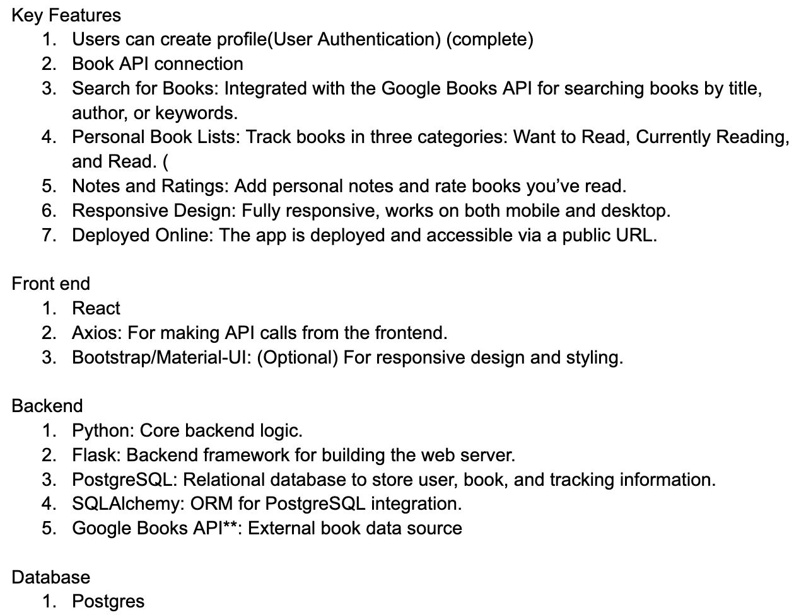

# Milestone Project 3: Book Tracker

## Description

This project includes a full-scale application that allows users to create an account to keep track of books they're reading. Through the Google Books API, users are able to search and view book details and add them to their personal book list. 

### Background

---

This book tracker application was submitted as the final project for our Software Development Bootcamp. The assignment was to create and deploy an application showcasing all of our skills learned throughout the program. 

### Challenges & Solutions

---

This was the initial outline created to guide the build of the Book Tracker application. 

### Potential Roadmap

---

Here are some stretch goals we have discussed to be implemented in the future. 

- Book status toggle function where users can specify whether they want to read, are currently reading, or have read a book
- Social engagement like commmenting and following other user profiles
- Reading goal tracker with badges or other rewards for streaks

## Contributing

This is a personal project created for learning purposes but we are open to any contributions.

### To contribute code or documentation

1. Clone this repository
2. Add code or documentation
3. Commit and push
4. Wait for pull request to be reviewed and merged

### To report a bug or make suggestions

Submit an issue [here](https://github.com/adtweber/Book-Tracker-App/issues) explaining the problem or improvements you'd like to see.

## License
[MIT](https://github.com/adtweber/Book-Tracker-App/blob/main/LICENSE.txt)

